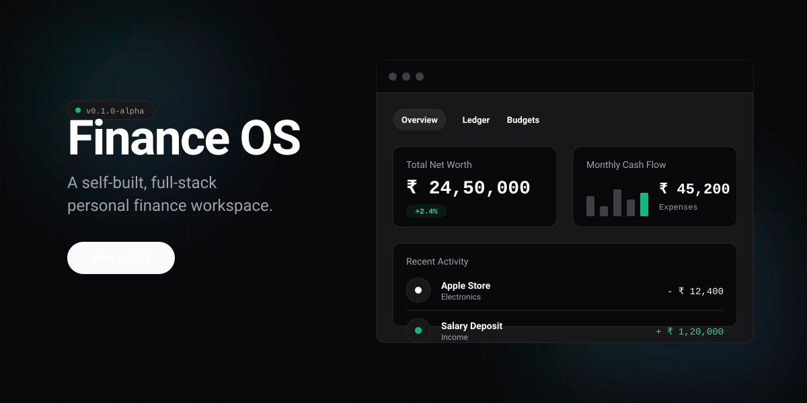
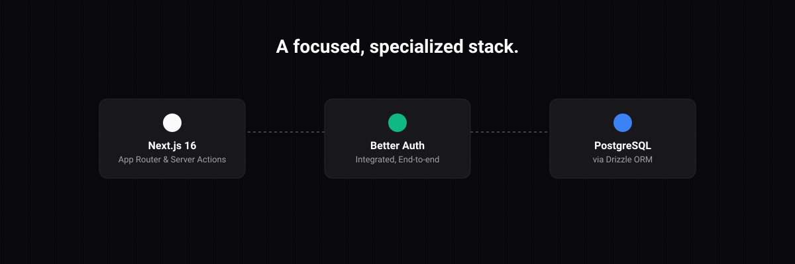

<div align="center">
  
</div>

A self-built, full-stack personal finance workspace. No templates. No workarounds. Just a purpose-built tool that does exactly what it needs to do.

## Why this exists

I managed my finances in Notion for a long time using custom databases, linked properties, and rollups. Notion is exceptional for documents, but personal finance is a data problem. Calculated properties only go so far when the data model doesn't match your mental model. Filters reset, views break, and a simple spending trend chart becomes impossible.

Finance OS is the answer to that limit: a system where the data model is mine, the UI is deliberate, and the behavior is exactly what I want.

## How it works

<div align="center">
  
</div>

Finance OS is built around the core primitives of personal finance, giving you a fast, uncompromised interface to work with them.

- **Dashboard:** The central overview. Shows total net worth, cash flow, and account distribution. Chart data streams in parallel via React `Suspense`.
- **Transactions:** A unified ledger powered by TanStack Table. Every entry is strictly typed (expense, income, transfer) at the database level.
- **Budgets & Goals:** Live category tracking against spending limits, plus atomic savings goals that automatically record transfers and update progress.
- **Accounts:** A registry of financial accounts—checking, credit cards, investments—tracking live balances.

## Tech Stack

- **Framework:** Next.js 16 (App Router, Server Actions, Server Components)
- **Database:** PostgreSQL on Supabase via Drizzle ORM
- **Auth:** Better Auth (Google OAuth + Email)
- **UI:** Tailwind CSS v4, Base UI, Radix UI
- **Visualization:** Recharts, Number Flow
- **Motion:** Framer Motion, GSAP

## Getting Started

### Prerequisites

- Node.js 20+
- PostgreSQL database (Supabase recommended)
- Google Cloud project (for OAuth)

### Setup

```bash
# Install dependencies
npm install

# Set up your environment (requires DATABASE_URL, BETTER_AUTH_SECRET, Google OAuth)
# See the repository for exact keys required.

# Push the schema to your database
npx drizzle-kit push

# (Optional) Seed the database with sample data
npx tsx db/seed.ts

# Start development server
npm run dev
```

Visit `http://localhost:3000` to see your dashboard.

## Design Decisions

- **Server-First Execution:** Data is fetched on the server with Server Components. Client bundles stay lean, improving Time to First Byte without loading spinners on initial render.
- **Parallel Streaming:** Dashboard charts initiate queries at the top level and pass promises to `Suspense` boundaries to resolve and hydrate independently.
- **Atomic Operations:** Money movement (like goal funding) uses PostgreSQL transactions to ensure consistency across multiple tables.
- **Database Truth:** Data integrity is enforced via `CHECK` constraints and `UNIQUE` indexes in PostgreSQL, not just application-level Zod schemas.

## License

This project is personal software, built for personal use. It is shared publicly for reference and learning purposes.
